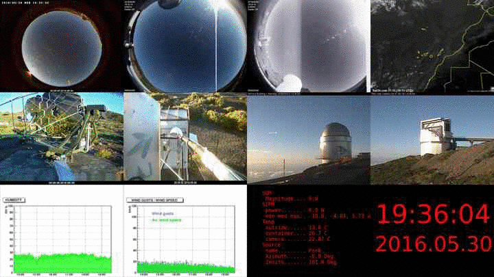
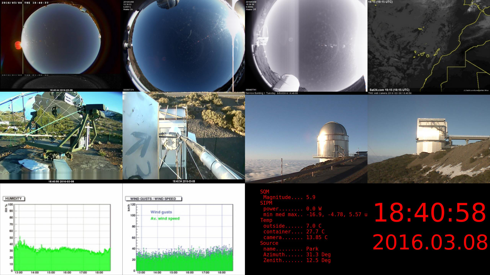
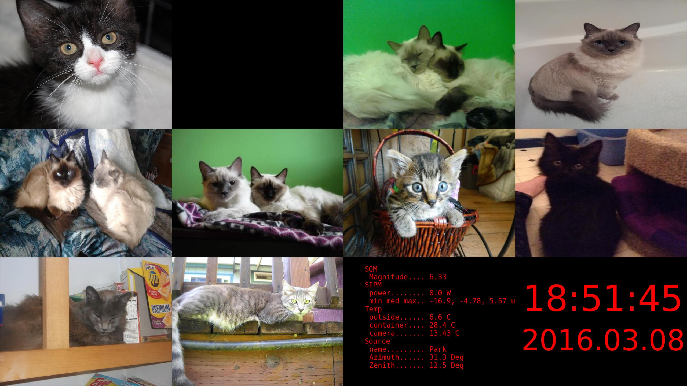

# la_palma_overview
Make nightly overview videos of the Roque observatory on La Palma or just save single overview images



## Video
##### Usage
```bash
user@machine:~$ la_palma_overview_video
```
Creates a directory structure as year/month/night and saves overview images all night long. At the end of the night it creates a video from the images.

## Images
##### Usage
```bash
user@machine:~$ la_palma_overview
```
When called without a specific output path [-o], the image filename will be created using a timestamp like 'la_palma_yyyymmdd_HHMMSS.jpg'

or in python:
```python
import la_palma_overview as lpo
lpo.save_image('/home/user/my_la_palma_image.jpg')
```


or when you feel sad:
```python
import la_palma_overview as lpo

config = {
    'img': {'rows': 480, 'cols': 640},
    'stacked_image': {'rows': 3, 'cols': 4},
    'image_urls': [
        'http://goodmorningkitten.com/media/kittypix/1/kitten1151.jpg',
        'http://goodmorningkitten.com/media/kittypix/12/kitten12065.jpgg',
        'http://goodmorningkitten.com/media/kittypix/12/kitten12063.jpg',
        'http://goodmorningkitten.com/media/kittypix/12/kitten12063_02.jpg', 
        'http://goodmorningkitten.com/media/kittypix/12/kitten12063_05.jpg',
        'http://goodmorningkitten.com/media/kittypix/12/kitten12063_07.jpg',
        'http://goodmorningkitten.com/media/kittypix/12/kitten12050.jpg',
        'http://goodmorningkitten.com/media/kittypix/12/kitten12056.jpg',
        'http://goodmorningkitten.com/media/kittypix/12/kitten12057.jpg',
        'http://goodmorningkitten.com/media/kittypix/12/kitten12061.jpg'
    ]
}

lpo.save_image(output_path='/home/user/now_i_feel_better.jpg', overview_config=config)
```


## Dependencies
- [smart_fact_crawler](https://github.com/fact-project/smart_fact_crawler)
- sci-kit image
- send2trash
- avconv from libav

## How
collects several different images as all sky cam footage:

- [FACT all sky cam](http://fact-project.org/cam/skycam.php)
- [MAGIC all sky cam](http://www.magic.iac.es/site/weather/AllSkyCurrentImage.JPG)
- [GTC all sky cam](http://www.gtc.iac.es/multimedia/netcam/camaraAllSky.jpg)

and on site footage as e.g.:

- [FACT overview cam](http://www.fact-project.org/cam/cam.php)
- [FACT lid cam](http://www.fact-project.org/cam/lidcam.php)
- [NOT cam](http://iris.not.iac.es/axis-cgi/jpg/image.cgi)

but also plots like e.g.:

- [MAGIC humidity](http://www.magic.iac.es/site/weather/lastHUM6t.jpg)
- [MAGIC Wind speed](http://www.magic.iac.es/site/weather/lastWPK6t.jpg)

Further there is a UTC time stamp and the FACT telescope status appended.
When an image can not be downloaded within 15s it is skipped and becomes black.
